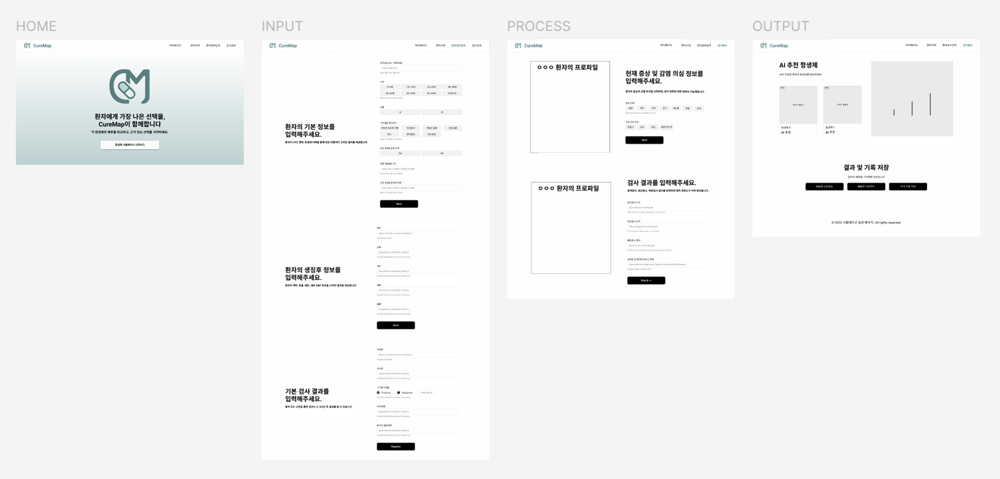

# CureMap: AI 기반 경험적 항생제 치료 예측 시뮬레이터

> 용인세브란스병원 디지털 헬스케어 해커톤 참가작 

---

**대회명:** 2025 용인세브란스병원 디지털 헬스케어 해커톤 

**참가 트랙:** Track2 - 항생제 기반 감염병 데이터 분석 

**참가자:** 한국외국어대학교 컴퓨터공학부 4인 팀 (Team 치트키) 

**Member:** 이효원(팀장 및 AI), 이신비(AI), 최성준(FE), 남하원(BE)

**기간:** 2025년 5월 9일 ~ 5월 10일 

**역할:** AI / 데이터 분석 (의료 데이터 분석 및 전처리, XGBoost 기반 예측 모델 설계·학습) 

---

## 💡 Project Overview(Service Flow)

**CureMap**은 실제 의료 현장에서 의료진의 항생제 처방을 지원하기 위한 AI 기반의 **경험적 항생제 추천 및 예측 시뮬레이터**입니다.

감염병 치료에서 초기 항생제 선택은 매우 중요합니다.  
그러나 실제 임상 환경에서는
- 환자 기저질환이 다양하고
- 배양 결과가 늦게 나오며
- 경험적 항생제 선택에 의존하는 경우가 많습니다.

이 문제를 해결하기 위해 환자 데이터를 기반으로 항생제 적합성을 예측하는 모델을 설계했습니다.

환자의 기저질환, 검사 결과, 생체징후 등의 데이터를 AI가 종합적으로 분석하여, 적절한 항생제 처방의 근거있는 선택을 돕는 것을 목표로 합니다. 특히, 주요 타겟 감염병 중 하나인 **요로감염(UTI)** 관련 환자 데이터(N10, N11, N39.0 등)를 중점적으로 타겟팅하여 예측 모델을 구축하였습니다. 결과 화면에서는 추천 항생제 2가지를 이미지로 보여주고, 항생제 별 예후 수치를 시각화한 이미지를 같이 제공하여 왜 다음과 같은 2가지 항생제를 추천했는지 설명합니다.  

✔ 초기 경험적 항생제 선택의 정확도 향상

✔ 항생제 오남용 감소 및 내성균(AMR) 문제 완화

✔ 제한된 정보 속에서의 신속한 임상적 의사결정 지원

---

## 🧩 AI / Data Analysis Overview (by 이신비)

> 정제되지 않은 복잡한 병원 데이터를 분석 및 재전처리하여 분석 가능한 하나의 테이블로 가공하고, 최적의 예측 모델을 주도적으로 개발했습니다.

### 📁 Preprocessing

1. **데이터 병합 및 정제**
* 5개 이상의 개별 테이블(내원정보, 바탕질환, 생징후, 검사결과, 배양검사결과 등)을 RGNO(환자 등록번호)와 VTHOS_NO(내원번호)를 기준으로 병합하여 최종 데이터셋(merged_final.csv) 생성

2. **Target 질환 추출**
* ICD-10 코드를 기반으로 급성/만성 신우신염(N10, N11) 및 방광염(N30.0) 등 **요로감염(UTI)** 환자 코호트를 집중적으로 필터링

3. **Feature Engineering**
* 모델 학습을 위해 불필요한 Target 컬럼(label)을 분리하고, 데이터를 학습용(Train)과 테스트용(Test)으로 분할 시 클래스 불균형을 고려하여 stratify=y 옵션을 적용

4. **결측치 및 이상치 처리**

5. **정규화 및 데이터 인코딩**
* Positive / Negative / NaN 정규화
* 범주형 데이터 인코딩

### 🔧 주요 데이터 활용 명세

| 테이블명 | 활용 특성 (Features) |
| --- | --- |
| **내원정보** | 연령대(AGE_GROUP), 성별(SEX_CD), 등록번호(RGNO) |
| **바탕질환** | ICD-10 코드(ICD10CD) |
| **생징후** | 항목명(IEM_NM), 항목내용(IEM_CONT) |
| **검사결과** | 검체명(SPCM_NM), 부검사명(SEXAM_NM), 수치결과내용(NMVL_RSLT_CONT), 결과내용(RSLT_CONT) |
| **배양검사결과** | 검체명(SPCM_NM), 세균명(GERM_NM), 항생제명(ANTBT_NM), 결과내용코드(RSLT_CONT_CD) |

---

## 🤖 Model Architecture

> 대규모의 복잡한 의료 데이터에서 빠르고 높은 성능을 확보하기 위해 트리 기반의 앙상블 모델인 **XGBoost**를 핵심 알고리즘으로 채택했습니다.
> - **XGBoost**
> - **5-Fold Cross Validation**
>
> 

* **분류기 (Classifier):** `xgb.XGBClassifier` (`eval_metric='logloss'`, 범주형 데이터 처리를 위한 설정 포함) 

* **하이퍼파라미터 튜닝 (Hyperparameter Search Space):** 

* `n_estimators`: [100, 200, 300] 

* `max_depth`: [3, 4, 5, 6] 

* `learning_rate`: [0.01, 0.05, 0.1] 

* `subsample` 및 `colsample_bytree`: 과적합을 방지하기 위해 0.6 ~ 1.0 범위 탐색 

* `gamma`,`reg_alpha`, `reg_lambda`: 정규화 파라미터 적용으로 모델 일반화 성능 향상 

---

## 🛠️ Tech Stack

* **Language:** Python 3.x
* **Libraries:** Pandas, Numpy, Scikit-learn, XGBoost, Matplotlib, Seaborn

* **Training Strategy:** 불균형 데이터 처리, 감염 질환 그룹별 분류 전략 설계, Cross Validation 기반 일반화 성능 검증

* **Environment:** 폐쇄망 가상 서버 (Linux VM) 

cf. 이 프로젝트는 **병원에서 제공한 실제 의료 데이터**를 다루었기 때문에, 비식별화(SHA-256 암호화 등) 조치된 데이터를 **폐쇄망 가상 서버(VM) 환경**에서만 분석해야 했습니다.
즉, 보안상의 이유로 AI 예측 서버와 백엔드/프론트엔드 웹 서비스를 **직접적으로 연결할 수 없는 제한된 환경**이었습니다. 따라서 저희 AI 팀은 주어진 폐쇄 환경 내에서 개별적으로 흩어져 있는 데이터 테이블들을 통합하여 **최적의 머신러닝 파이프라인을 구축**하고, 백엔드 로직에 예측 알고리즘 및 규칙을 전달하는 방식으로 역할을 분리하여 프로젝트를 진행했습니다.

* **Data Format:** CSV 분산 환경 데이터 

---

## 👤 Author
**이신비(2mystery)**, 한국외국어대학교 컴퓨터공학부, 2dltlsql@hufs.ac.kr
