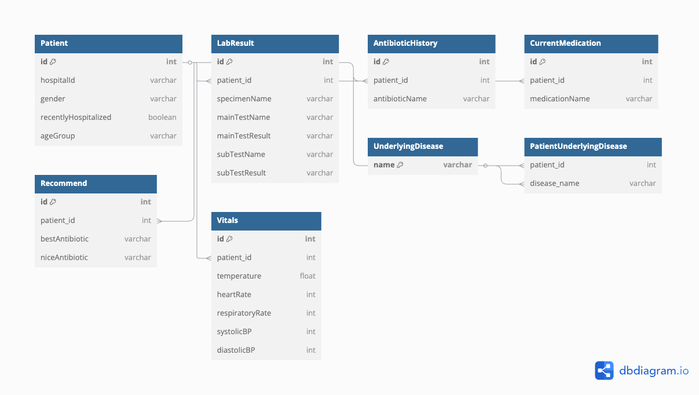

# 🧠 CureMap: AI 기반 항생제 치료 예측 시뮬레이터

> 용인세브란스병원 디지털 헬스케어 해커톤 참가작  
> Track 2 – 항생제 기반 감염병 데이터 분석  

---

## 🏆 About the Competition

**대회명:** 용인세브란스병원 디지털 헬스케어 해커톤  
**참가 트랙:** 항생제 기반 감염병 데이터 분석  
**참가자:** 한국외국어대학교 컴퓨터공학부 4인 팀  
**기간:** 2025년 5월 9-10일  
**역할:** 백엔드 개발 (Spring Boot 기반 서비스 아키텍처 설계 및 구현 총괄)

---

## 💡 Project Overview

**CureMap**은 실제 의료 현장에서 항생제 처방을 지원하기 위한  
AI 기반의 **경험적 항생제 추천 시뮬레이터**

의료진은 환자 정보(기저질환, 검사 결과, 생체징후 등)를 입력하면  
AI가 과거 데이터를 기반으로 적절한 항생제 조합과 성공률, 입원 예측, 부작용 위험 등을 반환합니다.  
그 결과를 의사결정에 활용할 수 있도록 **웹 서비스 형태로 구현**하는 것이 목표였습니다.

---

## 📌 상황 설명

이 프로젝트는 **실제 병원 데이터를 가상 서버(VM)에서 분석**해야 했기 때문에,  
보안상의 이유로 AI 예측 서버와 웹 서비스를 **직접적으로 연결할 수 없는 환경**이었습니다.  
가상 환경에서는 Java, JavaScript 런타임이 제한되어 있었기 때문에 웹을 구동할 수 없었고,  
따라서 프론트/백엔드와 AI 서버는 분리된 상태로 개발되었습니다.

---

## 🧩 Backend Overview (by HaWonNam)

> 설계부터 전체 구현까지 주도적으로 개발했습니다.

### 📁 프로젝트 구조

com.example.CureMap
├── controller # REST API 엔드포인트
├── domain # 엔티티 클래스
├── dto # 데이터 전달용 구조
├── repository # JPA 기반 데이터 접근 계층
├── service # 비즈니스 로직 계층

### 🔧 주요 기능 요약

| 기능 | 설명 |
|------|------|
| 환자 정보 관리 | 기저질환, 연령대, 생체징후, 복용 약물 등 입력 API |
| 검사 결과 처리 | 검사명, 수치, 단위 등 등록 및 조회 |

---

## 🗺️ ERD (Entity Relationship Diagram)

> 실제 데이터 기반으로 설계된 백엔드 도메인 모델  
> 관계형 구조로 환자 정보, 항생제 이력, 검사 결과, 예측 결과 등이 연결되어 있다.

---

## 📮 API Overview

아래는 CureMap 백엔드에서 구현한 주요 REST API 목록입니다.  
등록(POST)과 조회(GET)을 명확히 분리하여 정리하였습니다.

| 기능 | Method | Endpoint |
|------|--------|----------|
| 🧾 환자 등록 | `POST` | `/api/patients` |
| 🔍 환자 조회 | `GET` | `/api/patients/{id}` |
| ❤️ 생징후 등록 | `POST` | `/api/patients/{id}/vitals` |
| ❤️ 생징후 조회 | `GET` | `/api/patients/{id}/vitals` |
| 🧪 검사결과 등록 | `POST` | `/api/patients/{id}/lab-result` |
| 🧪 검사결과 조회 | `GET` | `/api/patients/{id}/lab-result` |

---

## 🛠️ Tech Stack

- **Language:** Java 17
- **Framework:** Spring Boot 3, Spring Web, Spring Data JPA
- **Database:** MySQL
- **Tooling:** IntelliJ, Postman, Git, dbdiagram.io

---

## 🔄 회고 (Reflection)

이 프로젝트를 시작하기 전, 나는 단지 스프링부트 강의를 따라 실습 예제를 구현해보던 학생이였다.  
직접 도메인을 설계하고, API 흐름을 생각하며 구조화해본 건 이번이 처음이었고,  
**'무언가를 처음부터 끝까지 만든다는 것이 얼마나 어렵고도 값진 일인지'** 깨닫게 되는 계기가 되었다.

프로젝트를 진행하며 단순한 코드 작성 너머의 고민들,  
즉 도메인 모델링, ERD 설계, API 명세 작성, 협업 브랜치 전략 같은 것들이  
얼마나 중요하고, 동시에 내가 지금 어떤 부분에 대한 지식이 부족한지를 알 수 있었다.

이번 기회를 통해 GitHub 협업 방식과 브랜치 전략도 정말 정말 중요하구나를 깨닫게 되었다.   
물론 이 레포지토리에는 내가 개발한 흔적이 남겨져 있지는 않다.

기존에는 HawonNam계정을 사용했었지만, 교내와 동아리 실습 레포지토리가 많아서 
계정별 역할을 분리하고자 새롭게 이 계정을 만들게 되었다.

> 이 프로젝트는 나에게 "백엔드 개발자로서의 첫 설계 경험"이자  
> 앞으로 어떤 방향으로 공부를 해야할지, 프로젝트의 경험이 얼마나 소중한지 알게 해준 내 '개발'의 시작이다.

## 👤 Author

**HaWonNam (forwoni)**  
한국외국어대학교 컴퓨터공학전공 2학년, Spring Boot 백엔드 개발자 지망생  
📧 [ktion0619@naver.com](mailto:ktion0619@naver.com)

